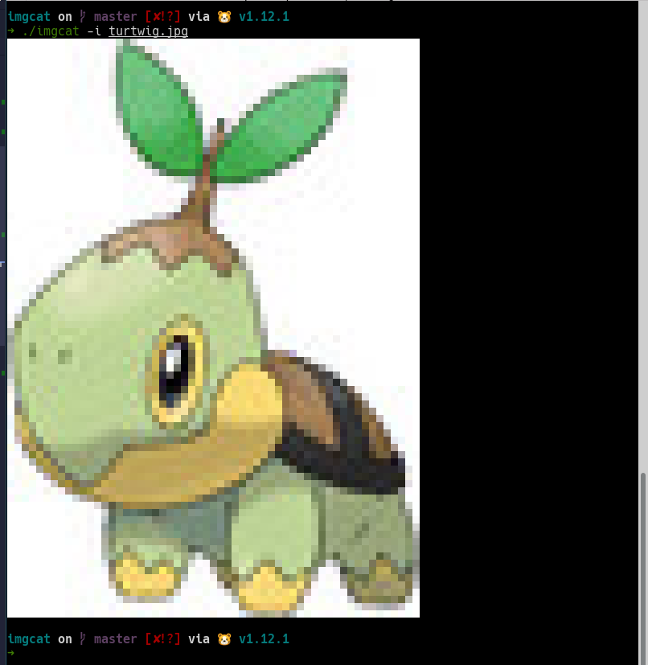

# imgcat

## Introduce

A simple utily to render an image to terminal. Support fetch from the internet.

Features:
* Ouput image 2 pixel per glygh
* Can fetch image from remote
* Auto analize your terminal size and scale output image base on it.

## Screenshots

<center>
    <p>Simple cat an image local</p>
    
    <p>Simple cat an image remote</p>
    
</center>

## Install

If you have go installed in your system.

```
go get -u github.com/stephentt-me/imgcat
```

Make sure `$GOPATH/bin` is in your `$PATH`.

Or [download binary here](#) and put it into your `$PATH`.

## Usage

"Cat" image from file
```
imgcat foo.jpg
```

"Curl" image from url
```
imgcat <url>
```

Render glob
```
imgcat *.jpg
```

Option:
```
-h  Help
-q  Quite
```

## License

MIT.